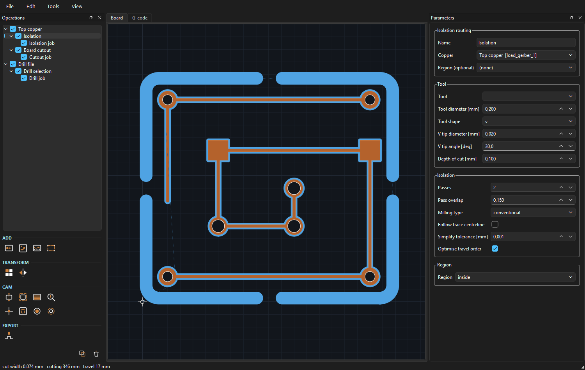
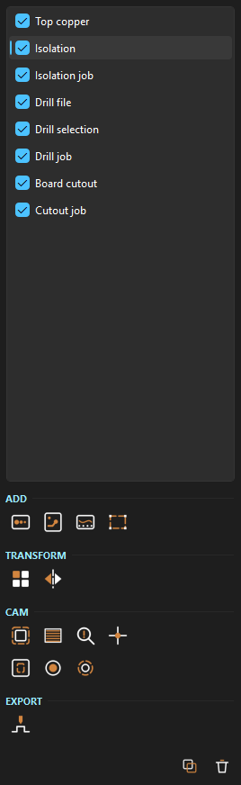
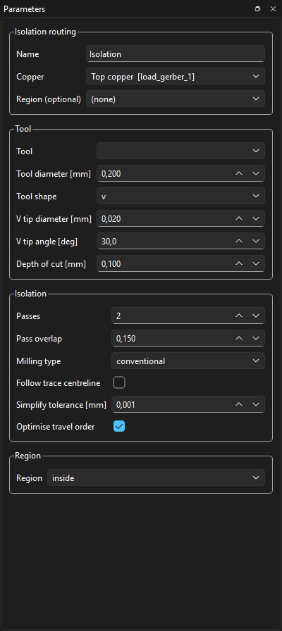
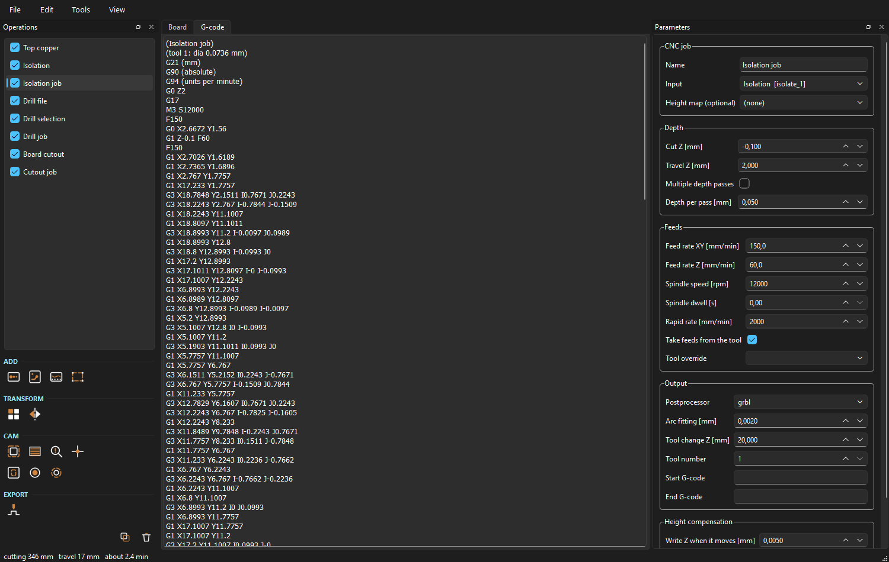
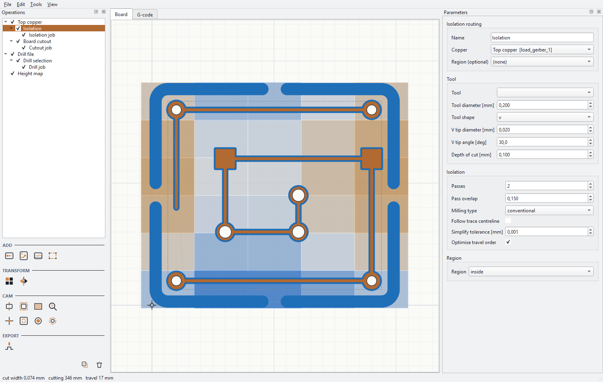
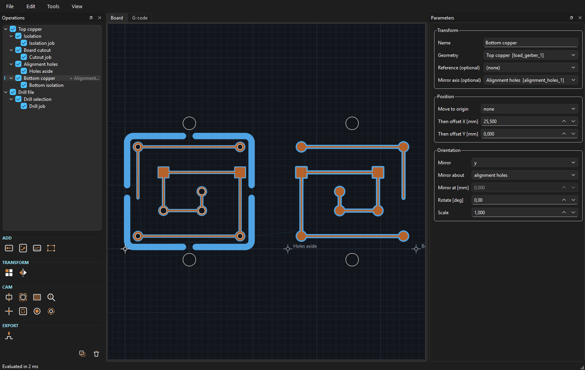
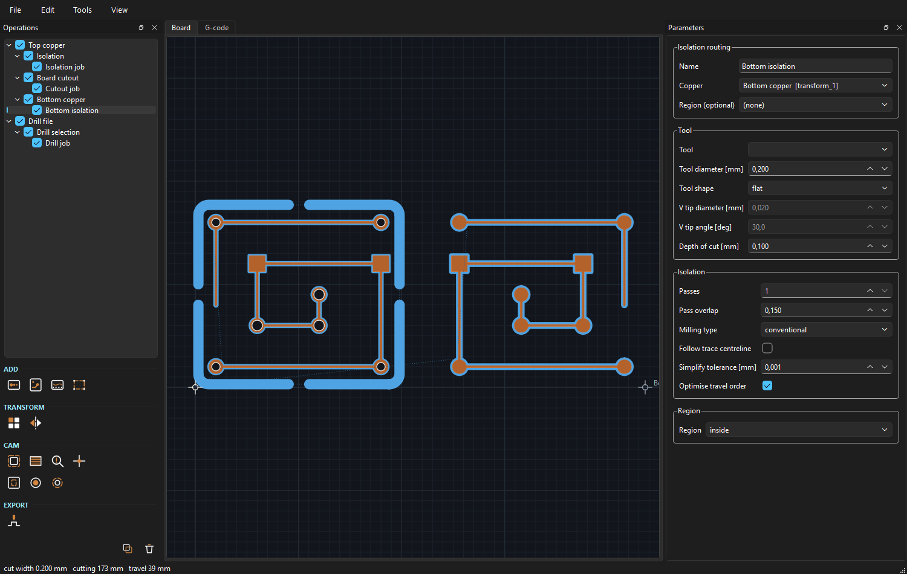
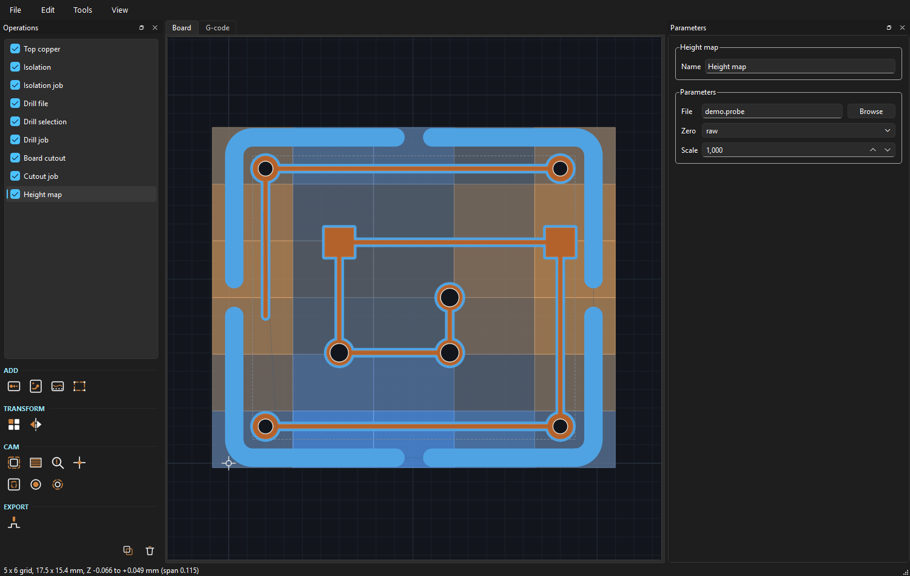

# aaltoCAM

Gerber to G-code for PCB isolation milling, built as a parametric graph
instead of a pile of one-way conversions.

Every object remembers the operation and the parameters that produced it.
Change the tool diameter three days later and the isolation geometry, the
travel ordering and the G-code all re-evaluate. Nothing is baked at creation
time, which is the one thing FlatCAM cannot do.



## Highlights

**The graph is the document.** Operations nest under whatever feeds them, so a
project reads as the pipeline it is: copper branching into isolation and
cutout, each ending in its own CNC job. Nesting follows the primary input, so
every operation appears exactly once — a height map feeding three jobs is a
root of its own and each job names it alongside, because the graph is a DAG
and duplicating a shared node would be a lie about the structure. Rename one in
place with F2 or a double-click, and untick it to drop it out of the view
without removing it or anything downstream.

**The panel writes itself.** Each operation declares its parameters once as
descriptors, and the form is generated from them — adding a parameter needs no
GUI code, and the panel cannot drift out of step with what the operation
actually accepts.

<p align="center">
  
  
</p>

**Read the G-code before you cut it.** The second tab is the output that will
reach the machine, and the status bar carries the cutting distance, the travel
distance and a time estimate while you are still deciding.



## Install

```
python -m pip install gerbonara shapely PySide6-Essentials
python -m pip install -e .
```

Python 3.11 or newer. The core needs only gerbonara and Shapely; PySide6 is
required for the GUI, not for the CLI.

## Run

```
aaltocam-gui                          # empty project
aaltocam-gui examples/demo/demo.toml  # open a project
aaltocam examples/demo/demo.toml -o out/   # headless, writes out/*.nc
aaltocam examples/demo/demo.toml --list    # show the graph
```

In the GUI: the palette under the operation list adds a node, the panel on
the right edits it, the board view updates as you type. Ctrl+E exports the
selected CNC job, Ctrl+Z and Ctrl+Shift+Z undo and redo.

Operations are named after the operation that made them. Rename one by
double-clicking it in the list, by pressing F2, or through the Name field at
the top of the parameter panel — a board with `Top copper` and `Board cutout`
in the list reads better than one with `Gerber file` and `Board cutout` a week
later. Renaming is undoable like any other edit, and clearing the name puts
back the node's id rather than leaving a blank row.

The palette is a grid of icons grouped the way the operations are categorised
— Source, CAM, Edit, Output — with the name and a one-line description on the
tooltip. The icons are drawn in code on a 100×100 grid rather than shipped as
files, so they stay sharp at any DPI and take their line colour from the
running palette, which keeps them legible in a light or a dark theme.

The application mark is the program's own subject: a copper track with a pad,
and the isolation channel milled around it. It is built the way the program
builds a toolpath — the channel is the copper shape grown by a tool radius —
so the mark cannot drift away from what the software does. Below about 28 px
it falls back to just the pad and its channel, because a favicon has room for
one idea. `python -m aaltocam.gui.icons <dir>` writes it out as `.ico` and
`.png`; the installer uses that for the desktop shortcut and the standalone
build, so the shortcut and the running window always show the same mark.

**View → Theme** switches between dark and light. The choice is written to
`settings.toml` beside the tool library and worn at the next start, not this
one — restyling a running window means rebuilding every drawn icon and every
item already in the scene, and doing that halfway through a job is a good way
to lose the view you were working in. The menu says so when you pick one.



The light theme is not the dark one inverted. Copper on white has to be darker
to still read as copper, the toolpath blue has to survive a pale ground, and
the origin marker swaps from near-white to near-black because its job is to be
the most legible thing on screen.

**File → Open board folder** (Ctrl+Shift+O) points at a KiCad plot
directory and builds a working graph from what it finds: copper, drills and
Edge.Cuts wired through isolation, drilling, hole milling and cutout. It
reports what it recognised and what it skipped rather than silently
producing an empty project. Filename matching covers KiCad, Altium and
Eagle conventions. **File → Open KiCad board...** (Ctrl+Shift+K) skips the
plot step entirely — see below.

## How it fits together

```
Gerber file ──► Isolation routing ──► CNC job ──► .nc
            └─► Board cutout    ──► CNC job ──► .nc
Excellon    ──► Drill holes     ──► CNC job ──► .nc
```

- `aaltocam/core/graph.py` — nodes, dependency tracking, content-hash caching.
  Editing a parameter invalidates only that node and its descendants.
- `aaltocam/core/ops.py` — the operation library. One function per operation,
  with its parameters declared once as descriptors.
- `aaltocam/core/geometry.py` — gerbonara primitives to Shapely, V-bit width
  model, fills, and travel-order optimisation.
- `aaltocam/core/gcode.py` — postprocessors.
- `aaltocam/gui/` — a viewer and a form. The form is generated from the
  parameter descriptors, so adding a parameter needs no GUI code.

Projects are TOML with relative paths: readable, diffable, and safe to keep
in git next to the KiCad project. Saving records which side was built and
which `.kicad_pcb` the plot came from, so **Re-plot from KiCad** still works
after closing and reopening. Paths are rewritten relative to wherever you save,
so "save as" into another folder keeps every reference intact. Closing with
unsaved changes asks first, and the title bar carries a `*` while there are
any.

## Operations

| Operation | Notes |
|---|---|
| Gerber file | RS-274X copper layer, optional polarity inversion |
| Region | rectangles and polygons drawn on the board view, grow/shrink, invert |
| Clearance check | finds gaps the isolation tool cannot enter, before you cut |
| Excellon drills | diameter filtering on load |
| Isolation routing | multi-pass, overlap, climb/conventional, follow mode, V-bit width from depth, region mask |
| Clear copper | multi-tool rest machining, concentric or line fill, keep-out around traces, region mask |
| Board cutout | rectangle, convex hull or a connected Edge.Cuts outline, tool side, 0/2/4/8 holding tabs |
| Internal cutout | slots, windows and mounting holes inside the board, tool side, tabs per opening |
| Drill holes | grouped by diameter, nearest-neighbour ordering, large holes handed to milling |
| Mill holes | circular interpolation for holes at or above a size threshold |
| Transform | move to origin, mirror, rotate, offset, scale — works on any payload, with an optional shared reference |
| Panelize | rows, columns, spacing |
| Height map | probed X Y Z points, bilinear across a grid, nearest edge held outside it |
| CNC job | depth, feeds, multi-depth passes, postprocessor choice, optional surface compensation |

Postprocessors: `grbl`, `linuxcnc`, `generic`, `wegstr`.

A postprocessor can also describe the machine behind it — feed ceiling, rapid
rate, travel envelope, useful decimals. Those clamp what would otherwise be
silently wrong, and anything clamped or dropped comes back as a warning on the
CNC job node rather than being buried in the file.

## Opening a KiCad board

`File → Open KiCad board...` (Ctrl+Shift+K) takes a `.kicad_pcb` directly. It
does not parse the board: it runs `kicad-cli`, KiCad's own plotter, and imports
the Gerbers that come out. So the copper is exactly what the plot dialog would
have produced, zone fills are right by construction, and there is no stale plot
folder to forget about. `File → Re-plot from KiCad` (Ctrl+Shift+R) refreshes it
after a board edit.

Reading a `.kicad_pcb` for geometry is a trap worth naming. The file stores
design intent: tracks are centrelines with a width, pads are shapes that still
need the footprint's position, rotation and side applied, and zone fills are
only as good as the last time somebody pressed "fill". Getting any of it subtly
wrong yields copper that looks plausible and is half a millimetre off. The one
thing aaltoCAM does read out of the file is the layer table, which is metadata
rather than geometry.

The plot lands in `<board>-aaltocam-plot/` beside the board file, so a saved
project keeps working, and it is reused unless the board is newer. Outer copper
plus Edge.Cuts, one combined drill file, absolute origin for both so copper and
drills stay in register.

The same works headless — the CLI accepts a project, a folder of Gerbers, or a
board file:

    aaltocam board.kicad_pcb -o gcode/ --dialect wegstr --replot

Coordinates come out on KiCad's absolute origin, so unless you leave the move
to the origin on, the board sits wherever it sat on the sheet. `--no-origin`
turns it off from the CLI.

Requires KiCad 7 or later installed; `kicad-cli` is found on PATH or in the
usual install locations, or you can pass `--kicad-cli`.

## The tool library

Every cutter lives in one file, `tools.toml`, in your config directory
(`%APPDATA%\\aaltocam` on Windows, `~/.config/aaltocam` elsewhere; `AALTOCAM_TOOLS`
overrides). It is shared by every project, because the same cutters get used
across boards. **Tools → Edit tool library** opens it, **Reload tool library**
(Ctrl+Shift+T) picks up your changes.

Choosing a tool fills in the fields it governs -- diameter, shape, and on a CNC
job the feeds and depth -- and greys them out, so what you read is what will be
cut. A CNC job that inherits its tool from the geometry above it picks the
numbers up as soon as that geometry evaluates. Clear the tool to type your own
again; the numbers stay behind as a starting point.

A tool carries its geometry and the feeds that have been shown to work with it.
Geometry operations pick a tool instead of having its diameter typed into one
node and its feeds into another, and the CNC job inherits the feeds from
whatever tool the geometry was made for. Rest machining looks up each group's
diameter separately, so three tools mean three sets of feeds rather than one
compromise.

Feeds of zero mean *not established yet*. Such a tool still gives the operation
its diameter, but the job keeps its own feed fields and says so in a warning
rather than inventing numbers. The shipped library has geometry for the LPKF
mills and end mills, the spiral routers and the drill range, and measured feeds
for the four that have cut real boards:

| tool | XY | Z | depth |
|---|---|---|---|
| 0.15 mm RF mill | 120 | 60 | −0.06 |
| 1.0 mm end mill | 60 | 60 | −1.0 |
| 1.0 mm router | 60 | 60 | −1.6 in 0.75 passes |
| 0.7 mm drill | — | 100 | −1.0 |

Spindle speed is recorded but, on a Wegstr, never commanded: that controller's
parser has no `S` word, so the spindle is set by hand. The shipped tools all
record 11000 rpm, which is what the machine runs. The figure is written as a
comment beside the tool change, where the operator sees it when the machine
stops, and used for the chip-load readout in the status bar. Postprocessors for
machines that do command spindle speed use it normally.

Chip load is per tooth, from the XY feed for a mill and the plunge feed for a
drill. It is only as good as the flute count, which is assumed rather than
measured — correct it in `tools.toml` and every figure follows.

## Arcs

Shapely has no arcs, so a pad outline buffered by the tool radius arrives at the
postprocessor as a 64-sided polygon. The CNC job refits circular runs and emits
G02/G03 on dialects that support them — GRBL, LinuxCNC and Wegstr. On the sample
RF board that takes the isolation job from 1123 lines to 301 and the cutout from
721 to 74.

The fitting tolerance is a real deviation from the requested path, so the default
is 0.002 mm — half a Wegstr step. Loosening it to 0.005 buys about ten percent
more reduction for more than twice the error. Set it to zero for line segments
only. Straight runs, noisy runs and anything below the dialect's minimum arc
radius stay as lines, and path direction is preserved, so climb versus
conventional is unaffected.

## Travel optimisation

Toolpaths are ordered by greedy nearest-neighbour over both endpoints
(paths may be reversed), then improved with bounded 2-opt sweeps. On a
20×20 pad test board this cuts rapid travel by roughly a factor of two
against unordered output. The status bar reports cutting and travel length
for the selected node, so the effect of a parameter change is visible
immediately.

## Working on part of a board

Clearing the whole board is rarely what you want. **Clear copper** and
**Isolation routing** both take an optional **Region** input, with a mode
of `inside` (cut only there) or `outside` (cut everywhere else). A region
is any polygonal source:

- a **Region** node with shapes you draw on the board view,
- a Gerber layer loaded as copper — an Edge.Cuts or keep-out plot works
  directly, no conversion step.

To draw one: add a **Region** node, then *Draw rectangle* (drag) or
*Draw polygon* (click points, double-click or right-click to close,
Escape to cancel). Shapes are listed with their size and position, and
land in the project file as plain coordinates you can edit by hand.

Once drawn, a shape stays editable while its Region node is selected:

| Action | Result |
|---|---|
| Drag a handle | move that corner or vertex |
| Drag inside a shape | move the whole shape |
| Double-click an edge | insert a polygon vertex |
| Right-click a vertex | delete it (polygons keep at least three) |
| Double-click the list entry | type exact coordinates |

Everything snaps to 0.1 mm by default (View menu to turn it off), and moving
a shape snaps its first point and shifts the rest by the same corrected
delta, so dragging never distorts the geometry. Downstream operations
re-evaluate on release.
*Grow / shrink* buffers the whole region, which saves redrawing when you
want a little more clearance. *Subtract from reference* inverts it: with a
layer connected as reference, the region becomes that layer's bounding box
minus what you drew — the quick way to say "everywhere except here".

Regions are ordinary payloads, so they pass through **Transform** like any
other layer. Reference a region to the same layer as the rest of the board
and it follows the board when you zero or mirror it.

**Board cutout** takes an optional **Outline** input too: set the shape to
`outline input` and it follows your Edge.Cuts layer instead of a bounding
box or convex hull.

## Cutouts and tool side

Both cutout operations take a **Tool side**:

- `outside` — the tool runs outside the outline, so the part stays full
  size. This is what you want for a board perimeter.
- `inside` — the tool runs inside, so the opening stays full size. This is
  what you want for a slot or window.
- `on path` — the tool centre follows the line, margin ignored.

**Internal cutout** treats each polygon of its input as one opening, so a
Region node with three rectangles produces three separate contours, each
with its own holding tabs. Openings smaller than the tool are counted and
reported instead of silently disappearing — with a 1 mm cutter, a 0.6 mm
slot collapses on `inside` compensation and the status bar says so.

Holding tabs are sized against the opening, and a contour too small to hold
them is cut fully rather than skipped — the status bar says how many.

Offsetting whole polygons rather than individual rings means holes come out
right for free: a negative offset shrinks an outline and grows any hole
inside it, which is exactly what cutting an opening to size requires.

### The outline is drawn, not filled

`Edge.Cuts` never arrives as a board. KiCad plots it with a thin aperture, so
what reaches aaltoCAM is a ribbon a few hundredths wide tracing where the edge
goes — a polygon whose hole is the entire board. Cutting that ribbon's
boundary gives two passes: one round the outside, correct, and one a tool
width inside the edge, straight through the part.

So **Board cutout** takes the area the ribbon *encloses* before it offsets
anything. Nesting follows the even-odd rule, which is what a profile layer
means anyway: a loop inside a loop is a window, a loop inside that is an
island. The recovered edge is the centreline of the stroke rather than its
outer side, since a drawn edge means the line's centre — worth roughly
0.025 mm on a KiCad plot, which is six machine steps on the Wegstr.

A shape that arrives already solid — a Region node you drew, or copper — has
no ribbon to measure and passes through untouched.

## Checking before you cut

**Clearance check** finds the gaps your isolation tool cannot fit into.
A morphological closing by the tool radius fills every gap narrower than the
cut width; whatever the closing added that was not copper is exactly the
material the tool will fail to remove. Those places come out as shorts, and
they are invisible until the board is finished.

The check distinguishes two cases, because the naive version cries wolf on
every board. A sliver bridging two separate copper features is a short and
gets reported with its coordinates and drawn in red. A sliver tucked into
the concave corner where a trace meets its own pad is not — the tool just
leaves that corner slightly rounded — and is counted separately. On the
demo board a 0.2 mm cutter reports no shorts and thirty rounded corners.

CNC jobs also carry a run-time estimate from feeds, travel and plunge count.
It ignores acceleration, so it under-estimates on boards made of very short
segments; use it to compare two parameter choices, not to promise anyone a
finish time.

Excellon files sometimes contain milled slots. They are not cut yet, but the
count is reported on load so they cannot vanish unnoticed.

## Multi-tool clearing

**Clear copper** takes an ordered tool list and works largest first. Each
tool only cuts what the previous ones physically could not reach: after a
pass the region actually removed is subtracted, so the next tool sees only
the leftovers. The status bar reports the tool sequence and how much area
no tool could reach, which is the number that tells you whether adding a
smaller bit is worth the tool change.

The CNC job emits one tool change per group, in the dialect's own form
(`M6` for GRBL and LinuxCNC, an `M0` pause with a comment for the
conservative dialects).

## Drilling versus milling

**Drill holes** has a size threshold. Holes at or above it are dropped from
the drill job and picked up by a **Mill holes** node reading the same
Excellon file, which cuts them as circles at `(hole - tool) / 2` radius.
Both nodes read the same source, so the split is one number in two places
and the two jobs stay consistent.

By default milling leaves a loose slug. Turn on *Clear the whole hole* to
spiral out from the centre instead. Holes too small for the milling tool
are counted and reported rather than silently skipped, and circle
resolution follows the radius so a few holes do not become thousands of
lines of G-code.

## Reading the board off the screen

Zero is marked. Two dim lines cross the whole view at X0 and Y0, drawn under
the board so they never hide copper, and a small crosshair sits on the origin
itself in the foreground so it stays findable over a filled pour. Both are
painted in screen pixels, so the marker is the same size whatever the zoom.

**Measure** (`M`, or the View menu) turns clicks into distances. Click two
points: each end is labelled with its X and Y, and the line between them
carries the length, `Δx`, `Δy` and the angle. The reading also goes to the
status bar, where it survives panning about. Hold **Shift** to lock to one
axis — useful for a board width when your click is a hundredth off the corner.
Right-click or Escape clears, a third click starts a fresh measurement, and
`M` again leaves.

**Measure from origin** pins one end to X0 Y0. Distances from the machine
origin are the ones you actually key into the controller, and clicking exactly
zero by hand never works. Turning it on part-way through keeps the point you
already picked and re-references it to zero rather than throwing it away.

Middle-drag pans in every mode, including while measuring or drawing a region
— a mode you cannot pan out of is a trap.

## Turning the board over

**Alignment holes** puts two registration holes on the line the board will be
flipped about — through the board and into whatever it is clamped to, so they
become the pins it locates on afterwards. Two, and on the axis: a pair off the
axis, or a third hole, only adds ways for the board to sit down wrong.



The reason to place them here rather than by hand is that the node publishes
the axis. Wire it into a Transform's **Mirror axis** input, set **Mirror about**
to `alignment holes`, and the mirror uses that exact line.

**This matters more than it sounds.** `Mirror about` defaults to `reference
centre` — the middle of the bounding box — which is right only if you happen to
turn the board over about exactly that line. Flip it about pins somewhere else
and the far side lands out by twice the distance between the two lines. On the
demo board the centre is x = 10.05 mm, so flipping about x = 0 instead would put
the bottom side 20.1 mm adrift: well-formed geometry, registering nowhere,
discovered after the copper is cut. Naming the line is what stops that.

Three ways to name it, and they agree with each other:

| Mirror about | The line is |
|---|---|
| `reference centre` | the middle of the reference bounding box — the old behaviour, so existing projects are unchanged |
| `coordinate` | a number you type: X for a `y` mirror, Y for an `x` one |
| `alignment holes` | the line through the pins wired into **Mirror axis** |

Pins on one axis and a mirror about the other is refused rather than computed:
a board turned over about one line cannot be mirrored about the other, and a
plausible-looking answer there is worse than an error.

## Both sides at once

**Edit → Place beside the board** (Ctrl+Shift+B) moves the selected layer clear
of everything already on the bed and gives it a working area of its own, so the
two sides of a board can be seen and worked on together. Set **Mirror** to `y`
on the Transform it creates and the second area is the bottom side.



The offset is real geometry, not a drawing trick. The cursor readout, the
measuring tool and the G-code all agree with what is on screen, and the layer is
milled by zeroing the machine on its new origin — which is marked, dimmer than
the machine zero, because there is only ever one of those. After a mirror that
marker moves to the other corner, which is the point: it is showing where zero
actually is once the board is flipped, not where it used to be.

**View → Go to next origin** (`O`) cycles the view between them. At a working
zoom only one area is on screen at a time, and hunting for the other is
tedious.

A whole side — copper, drills, outline — driven through one shared Transform
lands on one shared zero, so the marker appears once rather than once per
layer. That is the same shared-reference discipline described below, and the
reason to keep it.

## Positioning and registration

**Transform** moves a layer to the origin: pick which corner of the
bounding box lands on X0 Y0 (`bottom left`, `centre`, `top left`,
`bottom right`), then apply an offset on top if you want a margin.

The optional **Reference** input is the part that matters. Left empty, a
layer pivots and aligns about its own bounding box — and copper and drills
never have the same bounding box, so zeroing or mirroring them separately
walks them out of registration. Connect both transforms to the same
reference (usually the copper layer) and every layer moves identically:

```
Gerber ─┬─────────────────► Transform (ref: Gerber) ──► Isolation ──► CNC job
        └── reference ────► Transform (ref: Gerber) ──► Drill holes ─► CNC job
Excellon ──────────────────┘
```

On the demo board the copper starts at (1.30, 1.30) and the drills at
(1.60, 1.60). Zeroed against the shared copper reference, the copper lands
on (0, 0) and the drills on (0.30, 0.30) — the 0.3 mm relationship is
preserved, which is what you want. Zeroing each against itself would put
both on (0, 0) and shift every hole by 0.3 mm.

## Where the board ends up

Importing a board asks three things in one dialog: which side, when there is
copper on both; whether to move it to the origin; and whether to add the usual
operations at all. Turn the last one off to load and place the files and stop
there, for when you want to look at a board rather than cut it.

The list opens with the files that were read, in the order they were read --
copper, outline, drills -- then the placement, then the toolpaths. 

**Move to the origin** puts the bottom-left corner of the board outline on
X0 Y0 and shifts every layer by that same amount. It is on by default, because
a Gerber plotted on KiCad's absolute origin arrives wherever the board sat on
the sheet, with negative Y: the sample RF board comes in at X 93.5, Y -100 and
lands at X 0, Y 0 with it on. On a Wegstr, whose travel is 0-140 by 0-200, that
is the difference between coordinates that mean something and coordinates that
do not. It also removes the long rapid from the machine origin out to the
board, which the run-time estimate had been counting -- 150 mm of travel became
16 mm on that board.

The bottom side puts every layer -- copper, outline and drills -- through its
own Transform, all mirrored about Y against the *same* reference, the board
outline where there is one.

That shared reference is the whole point. Mirroring each layer about its own
bounding box looks correct on screen and drills through the wrong pads,
because copper and drills have different extents and so different centres.
One reference, one axis, everything moves by the same rule.

Mirroring about Y means the board is turned over left to right. Set the
`mirror` parameter on those Transform nodes to `x` if your fixture flips it
the other way.

With both on, a hole at x on the top side lands at (board width - x) on the
bottom, which is the property the tests actually check: flip the board over and
the same via is under the same drill.

## Height compensation

Copper-clad board is never flat, and an isolation pass 0.1 mm deep cuts air
over a high spot and through the substrate over a low one. Connect a **Height
map** to the second input of a CNC job and Z follows the probed surface.



The map is any text file with three numbers to a line -- X, Y and Z --
separated by spaces, tabs, commas or semicolons. bCNC `.probe` files load as
they are, header included. A comma is read as a decimal mark when that is the
only reading that yields three numbers, so `1,5 2,5 0,05` is three points'
worth of nothing surprising.

**Zero** on the map says what counts as no correction. `raw` adds the reading
as it stands, which is right for a file of deviations about zero; `mean` and
`origin` subtract the average or the reading at X0 Y0, for files holding
absolute heights. The status bar shows the map's Z span, which is how you
notice having chosen wrong before cutting.

Between probed points a full rectangular grid is interpolated bilinearly, and
scattered points fall back to inverse-distance weighting over the nearest four.
**Outside the probed area the nearest edge value is held**, never extrapolated:
past the measurements a warped surface can only be guessed at, and holding the
edge is wrong by a bounded amount rather than an unbounded one.

Two parameters on the job decide what reaches the file:

- **Sample spacing** splits long cuts before sampling. Correcting only at the
  ends of a 20 mm move leaves its middle uncompensated, which is exactly where
  a bowed board deviates most. 1 mm is a reasonable default.
- **Write Z when it moves** drops Z words that would barely move the axis. The
  comparison is against the last Z actually *written*, not the last computed,
  so a slow ramp cannot creep away one sub-threshold step at a time. On the
  demo board at 0.005 mm, 210 of 1112 cut moves carry a Z word and the rest
  inherit it.

Arc fitting is switched off for a compensated job, and the job says so rather
than doing it quietly. An arc holds Z across its whole sweep, so a compensated
G02 is correct at its two ends and wrong everywhere between them.

**If the controller levels for itself, do not also do it here.** Wegstr does. A
Wegstr job with a height map attached refuses to generate rather than
compensating twice and doubling the very error it is meant to remove. Switch
the machine's own levelling off and tick **Compensate anyway** if you mean it.

Drilling jobs ignore a height map and say so: a drill goes through the board,
so the surface height changes where the hole starts, not whether it finishes.
Milled holes arrive as toolpaths and are compensated like any other cut.

## What is not here

Honest list, since this is one build rather than years of accumulation:

- No Gerber, geometry or G-code editors. Fix the board in KiCad instead.
- No double-sided alignment wizard. `Transform` with mirror `y` handles the
  bottom side, but you place the alignment holes yourself.
- No film, QR, solder-paste, panel-marker, calibration or rules-check tools.
- Milled slots in Excellon files are counted but not cut.
- Evaluation is synchronous. A board taking several seconds will block the
  window during recompute. Moving evaluation onto a worker thread is the
  obvious next change.

## The Wegstr postprocessor

Written against what the Wegstr CNC software (v3.2.0) actually reads, taken
from the application rather than from documentation.

The controller accepts G00, G01, G02, G03, the G73/G81/G82/G83 drilling cycles,
and M00, M03, M04, M05, M06, M47. Everything else is skipped without comment,
so the dialect relies on none of it — no G4 dwell, no G43, no M2.

Its parser deletes spaces, cuts the first `(`…`)` pair on a line, and then reads
only the **first** G word. So: one G word per line, and no stray parentheses
inside a comment, which the postprocessor strips for you.

The machine runs at **170 mm/min maximum, and rapids are no faster** — G00 and
G01 share the ceiling. Feeds above it are clamped and reported, and the run-time
estimate uses 170 mm/min for travel regardless of the Rapid rate field, which
would otherwise be out by more than a factor of ten. One step is 0.004 mm, so
coordinates are written to three decimals. Travel is 140 × 200 × 40 mm; a job
whose span does not fit says so.

Tool changes emit `T<n> M06` followed by `M00`, which is the sequence the
controller wants. Z stays flat, because the Wegstr software applies its own
surface compensation and a height-mapped file would be compensated twice.

The machine supports G02/G03 with I/J in the XY plane, and arcs below 0.055 mm
or above 200 mm radius are refused, so the dialect declares those limits and the
arc fitter respects them.

## Verify before you cut

The `wegstr` dialect matches the software's parser and limits, but it has not
yet been run against the machine itself. Run the first job on scrap and read the
G-code before trusting it with a board.
